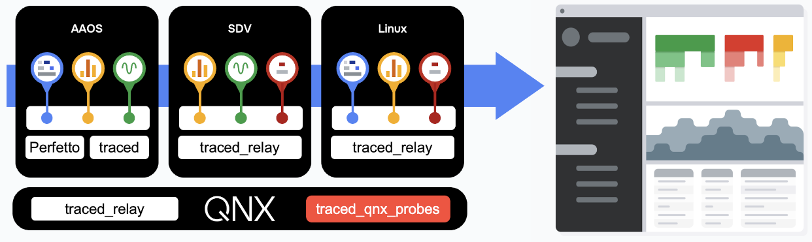
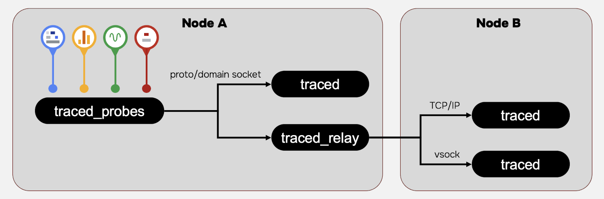
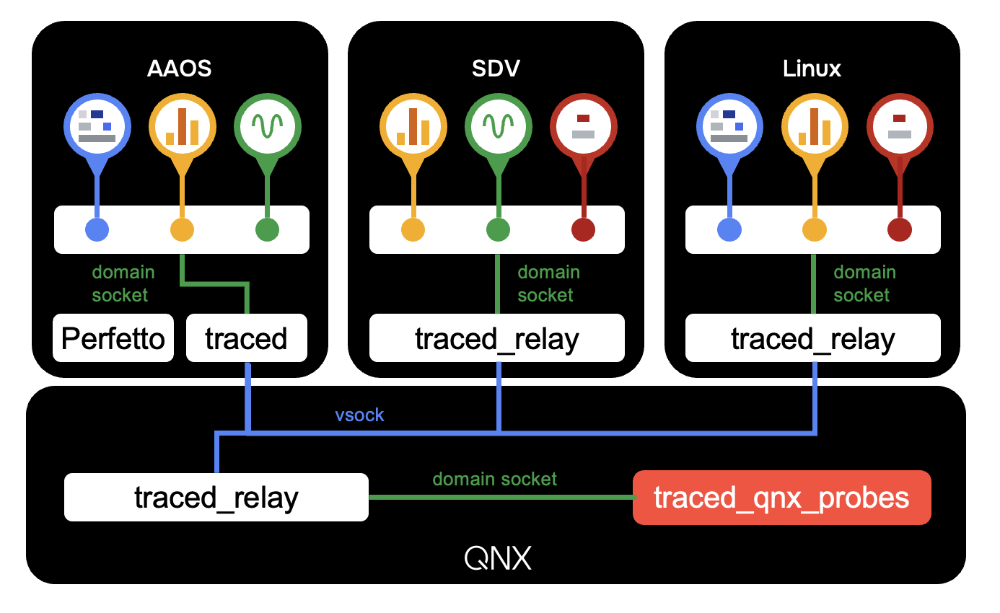

# Deploying Perfetto on QNX

This document describes how to deploy the Perfetto components to a QNX
target in order to run a trace that includes QNX kernel event data. It assumes
you have the Perfetto binaries for your target system.

See [Building Perfetto for QNX](qnx-probe-build.md) for details on how to build
the Perfetto binaries for a QNX target.

## Table of Contents

- [Copy the Perfetto Binaries to QNX Target](#copying-the-perfetto-binaries-to-qnx-target)
- [Tracing on a Hypervisor Host/Guest Deployment](#tracing-on-a-hypervisor-hostguest-deployment)
- [Example Deployment](#example-deployment)
- [Running a Perfetto Trace on QNX](#running-a-perfetto-trace-on-qnx)

## Copying the Perfetto Binaries to QNX Target

Deploying the Perfetto components is easy. Choose and/or create a directory to
house the Perfetto artifacts on your target system (e.g., /opt/perfetto). Copy
the binaries from the build output directory to the destination folder on your
target system.

***Example Deployment***

```bash
# A typical deployment might be in /opt but you can decide what suits your 
# system best

/opt/perfetto
  bin/
    traced
    traced_relay
    traced_qnx_probes
    perfetto
  lib/
    libperfetto.so
  etc/
    qnx_trace.cfg # Don't worry about the config file yet we'll cover that later
```

For details on creating a configuration file refer to
[Configure a Perfetto Trace for QNX](qnx-probe-configuration.md)

***Copy The Perfetto Components***

```bash
scp out/qnx_x64/traced <user>@<target-qnx-system-ip>:/opt/perfetto/bin
scp out/qnx_x64/traced_relay <user>@<target-qnx-system-ip>:/opt/perfetto/bin
scp out/qnx_x64/traced_qnx_probes <user>@<target-qnx-system-ip>:/opt/perfetto/bin
scp out/qnx_x64/perfetto <user>@<target-qnx-system-ip>:/opt/perfetto/bin
scp out/qnx_x64/libperfetto.so <user>@<target-qnx-system-ip>:/opt/perfetto/lib
```

## Tracing on a Hypervisor Host/Guest Deployment

A typical deployment involving the QNX kernel probe includes the tracing for
guest VMs as well as the QNX hypervisor/host.  Each node in the deployment has
at least one probe deployed to collect trace data. The nodes send the data
to a central ***traced*** daemon. Nodes that are not running ***traced***
send the data via the ***traced_relay***.



When deploying on a hypervised system you will need to decide where you want to
host the central ***traced*** daemon and where you want to use
***traced_relay***.

### Traced Relay

***trace_relay*** allows producers/probes that are not running on the same
system as ***traced*** to capture data by relaying it between their local system
and the system hosting ***traced***.

***traced_relay*** can communicate remotely with ***traced*** and can be
configured to use one of several transport protocols (e.g., TCP or virtio-vsock)
to send data between systems.



#### virtio-vsock

On hypervised system where ***traced_relay*** and ***traced*** are communicating
between the guest and the host, the recommended protocol is virtio-vsock.
However, using virtio-vsock will require that you have licenses for the QNX
Virtualization Framework and have the associated software package(s) installed
in your QNX SDP. If you don't have the QNX Virtualization Framework you can use
TCP between *traced_relay* and *traced* which is less efficient but will work.

#### Trace Session Orchestration

In addition to relaying trace information to ***traced***, ***traced_relay***
also relays the lifelcycle and session control requests from ***traced*** to the
local probes so that they can be orchestrated as part of a tracing session
(e.g., session configuration, start and stop).

#### Trace Event Time Synchronization

***traced_relay*** will negotiate time with between it's local node and the node
***traced*** is running on by sending peridodic clock snapshots. In the case of
QNX, the snapshot is based on the monotonic clock. These snapshots are included
in the trace and used to align the time for events on the relay node to events
on the ***traced*** node.

### Example Deployment

The following diagram demonstrates a deployment in which ***traced*** and
***perfetto*** are run in an Android guest VM while the ***traced_qnx_probes***
is run in the host and data is sent to ***traced*** via the ***traced_relay***.



From the diagram we can see that probes (***traced_probes*** and
***traced_qnx_probes***) communicate with either ***traced*** or
***traced_relay*** on the local node via domain socket. ***traced_relay***
communicates with ***traced*** over vsock or IP connection (usually vsock).

This is a common deployment for users who are already using Perfetto to trace
their Android guest and therefore already have perfetto and traced installed and
configured as part of their guest environment.

Note that it is possible to deploy ***traced*** on the QNX host and
***traced_relay*** on the guest. You will need to decide which type of
deployment suits your system best.

## Running a Perfetto Trace on QNX

Once you have deployed the Perfetto components to the target system you will
want to configure and run a trace. Refer to
[Running a Perfetto Trace on QNX](qnx-probe-tracing.md) for details on how to
configure and run Perfetto on QNX.
