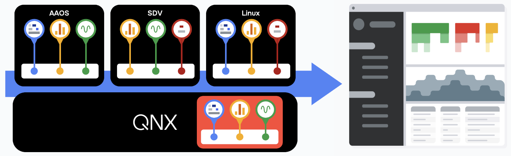

# Perfetto on QNX

## Table of contents

- [Overview](#overview)
- [Building Perfetto for QNX](#building-perfetto-for-qnx)
- [Deploying Perfetto on QNX](#deploying-perfetto-on-qnx)
- [Configuring Tracing for QNX](#configuring-for-qnx-tracing)
- [Running Perfetto on QNX](#running-perfetto-on-qnx)

## Overview

In order to support Perfetto tracing on QNX a custom probe
(***traced_qnx_probes***) has been added that integrates with the QNX kernel
tracing system to provide QNX kernel tracing data to Perfetto.

***traced_qnx_probes*** supports unified tracing for QNX hypervised systems
enabling Perfetto to collect and display consolidated tracing data that spans
both the host/hypervisor and guest systems.

***traced_qnx_probes*** uses the QNX microkernel's extensive tracing and
profiling support to collect and convert data into generic (non-OS/Linux
specific) Perfetto events and sends them into the Perfetto
system (e.g., traced) so they can be included in the tracing session.

For example,
The QNX probe collects information about processes and threads such as their id,
status, name, etc.

In addition to the new ***traced_qnx_probes*** component, the QNX Perfetto port
includes several key Perfetto components used to collect tracing data.
Specifically, the following components have been ported to QNX and can be
deployed on QNX systems.

- **traced**: The central tracing service daemon that coordinates trace sessions,
collects data from producers, and writes it to shared buffers.
- **traced_relay**: A relay service that forwards trace data between producers and
a remote or host tracing service, enabling cross-system or VM tracing.
- **perfetto**: The command-line client used to configure, start, and stop tracing
sessions and retrieve trace data from the tracing service.

## QNX Tracing Data

For a description of the data captured by *traced_qnx_probes* see
[QNX Tracing Data](qnx-probe-data.md).

## Building Perfetto for QNX

For a description of how to compile the Perfetto components for QNX including
*traced_qnx_probes* see [Building Perfetto for QNX](qnx-probe-build.md).

## Deploying Perfetto on QNX

For a description of how to deploy the Perfetto components on a QNX target see
[Deploying Perfetto on QNX](qnx-probe-deployment.md)

## Configuring for QNX tracing

For a description of how to configure *traced_qnx_probes* to enable tracing on
QNX see [Configuring Perfetto for tracing on QNX](qnx-probe-configuration.md).

## Running Perfetto on QNX

For a description of how to deploy and run Perfetto on QNX see
[Deploying Perfetto on QNX](qnx-probe-deployment.md).

## Known Issues

For a list of known issues see [QNX Probes KIL](qnx-probe-KIL.md).
