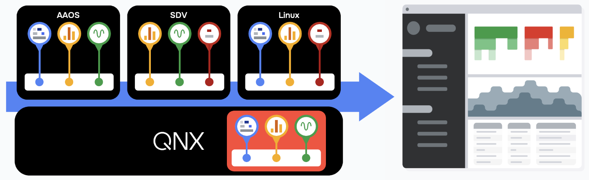

# Perfetto Trace on QNX 7.1

In order to support Perfetto tracing on QNX a new custom probe
(***traced_qnx_probes***) has been added that integrates with the QNX 7.1 kernel
tracing system to provide QNX kernel tracing data to Perfetto.



The QNX probe reports QNX kernel trace events to Perfetto using the
GenericTaskEvent and GenericProcessTreeEvent structure that allow the QNX probe
to report:
- Process Created/Named/Destroyed
- Thread Created/Named/Updated/Destroyed
- Process Tree info
  - **process**: pid, ppid, name, status
  - **thread**: pid, name, status

The goal of providing the QNX probe is to enable hypervised systems where there
are one or more guests VMs to collect and display a consolidated view of tracing
data that spans not only the guests but includes tracing data from the QNX 7.1
hypervisor host as well.

## Building Perfetto for QNX 7.1

In order to build the Perfetto components for QNX 7.1 you will need to have the
QNX 7.1 SDP installed on your system. This will enable building for a QNX target
system. See [QNX SDP 7.1](http://www.qnx.com) for details on how to install the
QNX SDP 7.1.

See [Perfetto Build Instructions](https://perfetto.dev/docs/contributing/build-instructions)
for a detailed description of the Perfetto build system.

### Clone the Perfetto project

Once you have QNX SDP 7.1 installed on your system you will need to get the
Perfetto source code, specifically the qnx-sdp7.1 branch that contains the new
QNX kernel probe.

```bash
# First, change into the Perfetto source directory
git clone github.com/qnx-ports/perfetto.git .

# 2. Change into the newly created repository directory
cd perfetto

# 3. Checkout the qnx-sdp7.1-main branch in order to get the QNX probe sources
git checkout qnx-sqp7.1-main
```

### Create a Perfetto build configuration for QNX Targets

Once you have the git project and the qnx-sdp7.1 branch you will need to create
a perfetto build arguments file:

```bash
# Run gn args which will open an editor for you to create the args file
# NOTE this also defines the output directory here you can see we are showing
#      the output for an x86_64 target but arm64 is also supported.
tools/gn args out/qnx_x64

# Ensure the args file has the following lines. NOTE target_cpu will be either
# "x64" or "arm64" depending on what type of system you are targeting.
target_os = "qnx"
target_cpu = "x64"

is_debug = false
```

### Build the Perfetto Components for QNX

Not all the Perfetto components are supported on QNX and the QNX kernel probe
doesn't build by default so you will need to specify it on the build command
line

```bash
# First you will need to source the QNX SDP environment so that your system
# knows where to find the QNX tooling (compiler, headers, libraries, ...)
source <QNX-SDP-7.1-directory>/qnxsdp-env.sh

# Change to the root directory of your Perfetto project
cd perfetto

# Build the Perfetto components for QNX including the QNX kernel probe
# NOTE: Here we are showing qnx_x64 but you will need to specify the same path
#       that you specified to tools/gn args previously.
tools/ninja -C out/qnx_x64 traced traced_relay traced_qnx_probe perfetto
```

This will leave the compiled executables for ***traced***, ***traced_relay***,
***traced_qnx_probes*** and ***perfetto*** in the out/qnx_x64 directory. You
will need to copy these to your QNX 7.1 target in order to run them.


# Deploying Perfetto on QNX

This section describes how you can deploy the Perfetto components to a QNX 7.1
target.

## Copying the Perfetto Binaries to QNX Target
Deployment of the components simply involves copying the binary executables to
the target system and selecting a directory to house them on the target.

```bash
scp out/qnx_x64 traced_qnx_probes <user>@<target-qnx-system-ip>:<path-to-perfetto>
scp out/qnx_x64 traced_relay <user>@<target-qnx-system-ip>:<path-to-perfetto>
```

## Tracing on a Hypervisor Host/Guest Deployment
The typical deployment involving the QNX kernel probe includes the tracing for
guest VMs as well as the QNX hypervisor/host.  Each node in the deployment has
a probe deployed to collect node trace data. The nodes send the data to the
central ***traced***. Nodes that are not running traced directly send the data
to ***traced*** via the ***traced_relay***.


### Traced Relay

The Perfetto ***trace_relay*** component helps support a wide variety of
deployment options as itallows the users to decide on which node they prefer to
run ***perfetto*** and ***traced***. Each node (guest/host) will have it's own
traced probe deployed and either ***traced_relay*** (configured to relay tracing
data to traced on a separate node) or ***traced*** directly if it is deployed on
the same node.


### Example Deployment

The following diagram demonstrates a deployment in which ***traced*** and
***perfetto*** are run in an Android guest VM while the ***traced_qnx_probes***
is run in the host and data is sent to ***traced*** via the ***traced_relay***.


From the diagram we can see that probes (***traced_probes*** and
***traced_qnx_probes***) communicate with either ***traced*** or
***traced_relay*** on the local node via domain socket. ***traced_relay***
communicates with ***traced*** over vsock or IP connection (usually vsock).

# Running Perfetto with the QNX Probe

## Configure and Run traced
***traced*** requires configuration to describe where it should listen for the
probes (or ***traced_relay***) to connect. For the probes connecting directly a
domain socket address is specified. For the relay connection a vsock or IP
connection is specified.
In the example we are running ***traced*** from a linux guest.

```bash
# One the Linux guest we set two variabls. The first is the address that relay
# from other nodes will use to connect to traced. The second is the local domain
# socket perfetto will use to connect to traced.
#
# e.g.,
# export PERFETTO_PRODUCER_SOCK_NAME=192.168.1.79:21000
# export PERFETTO_CONSUMER_SOCK_NAME=/tmp/perfetto.traced.sock
export PERFETTO_PRODUCER_SOCK_NAME=<traced-ip>:<traced-port>
export PERFETTO_CONSUMER_SOCK_NAME=<domain-socket-path>
```

```bash
# Run traced from the perfetto root directory by specifying the build output
# folder. You must use enable-relay-endpoint or else traced_relay on qnx won't correctly connect back to traced.
cd perfetto
out/linux_x64/traced --enable-relay-endpoint
```

## Configure and Run traced_relay
In this example we will run ***traced_relay*** on the QNX 7.1 host so that it
forwards trace data to ***traced*** in the Linux guest. In order to configure
***traced_relay*** we need to set both the address and port of traced and the
local domain socket that the QNX probe will use to communicate with it.

```bash
# On the QNX host target we set two variables. One that describes the path to
# the domain socket used by the QNX probe to talk to the relay. The second is
# address the relay will use to connect to traced.
#
# e.g.,
# export PERFETTO_PRODUCER_SOCK_NAME=/tmp/perfetto.probe
# export PERFETTO_RELAY_SOCK_NAME=192.168.1.79:21000
export PERFETTO_PRODUCER_SOCK_NAME=<relay-domain-socket-path>
export PERFETTO_RELAY_SOCK_NAME=<traced-ip>:<traced-port>

# You should see a message similar to
[884.290]          service.cc:249 Started traced, listening on <traced-ip>:<traced-port> <relay-domain-socket-path>
```

```bash
# Run traced_relay from the QNX 7.1 target's perfetto directory
cd perfetto
bin/traced_relay

# You should see a message similar to
[069.571] lay_service_main.cc:161 Started traced_relay, listening on <relay-domain-socket-path>, forwarding to <traced-ip>:<traced-port>
```

## Configure and Run The QNX Probe
```bash
# The QNX probes must have the environment variable that tells it the domain
# socket path used to communicate with traced/traced_relay.
# NOTE: This socket path MUST match the path specified when configuring
#       traced_relay
#
# e.g.,
# export PERFETTO_PRODUCER_SOCK_NAME=<relay-domain-socket-path>
export PERFETTO_PRODUCER_SOCK_NAME=<relay-domain-socket-path>
```

```bash
# Run traced_qnx_probes from the QNX 7.1 target's perfetto directory
bin/traced_qnx_probes

# You should see a message similar to
[076.840]              main.cc:80 Starting bin/traced_qnx_probes service
```
## Configure and Run perfetto
In order to trigger an orchestrate a trace you need to run the perfetto client.
The client will take the specified trace configuration and use traced to
coordinate the appropriate probes to perform the trace based on what is
configured for the trace.


### Create a Trace Configuration
The perfetto system uses JSON formatted configuration files in order to specify
the traced including, how long the trace should last, what probes should be
included in the trace and what configuration each probe should use.

```JSON
duration_ms: 10000

buffers {
  size_kb: 131072
  fill_policy: DISCARD
}

# Enable qnx data sources
data_sources {
  config {
    name: "qnx.kernel"
    target_buffer: 0
    qnx_config {
      # The number of buffers that tracelog will init for the QNX trace.
      qnx_kernel_buffers: 32

      # The number of kernel buffers that tracelog will init for the QNX trace.
      qnx_kernel_kbuffers: 64

      # Flag indicating whether the QNX kernel tracing should produce wide
      # events which contain additional data or fast events which are most
      # concise. In fast mode we lose the priority information with the benefits
      # of having small events which can be processed faster.
      qnx_kernel_wide_events: true

      # The number of pages initialized by default the parser's page cache.
      qnx_cache_pages: 4

      # The max pages the page cache should allocate (must be at least as big)
      # as the qnx_cache_pages value. Using -1 will allow the cache to grow
      # unbounded. The cache will prefer to re-use existing pages so growth will
      # only happen when needed (when parser is not keeping up).
      qnx_cache_max_pages: -1

      # The initial size of the the buffer used to hold the trace header values
      # this dynamic buffer will grow as needed but reallocs can be avoided by
      # selecting an initial size large enough to hold all the initial header
      # data.
      qnx_trace_buffer_init_bytes: 512
    }
  }
}

```

```bash
# perfetto client is run on the same node as traced is running. In our example
# it is run on the Linux guest. The client specifies the name and format of the
# output file into which traced will write the trace data, and the configuration
# file to use for the trace.
cd perfetto

# The following will run perfetto and record trace data into qnx.ptrace based on
# the config in example/configs/qnx_probes.cfg.
bin/perfetto -o qnx.ptrace --txt -c example/configs/qnx_probes.cfg
```


# Analyzing QNX Trace Events

## QNX Thread IDs

When using the QNX probe for Perfetto it is important to note that the way
Perfetto handles process and thread ids is somewhat different than how QNX
handles them. Specifically, the Perfetto system requires that thread ids be
globally unique which, while true on Linux systems, is not the case on QNX
neutrino. Rather, on a QNX based system thread ids are unique with a process.
So multiple threads will share the same thread id but they will belong to
separate processes. In order to overcome this difference, the QNX probe
generates a globally unique id for each thread (the extended tid) by merging
the globally unique process id with the thread id into a single 64 bit
integer.
